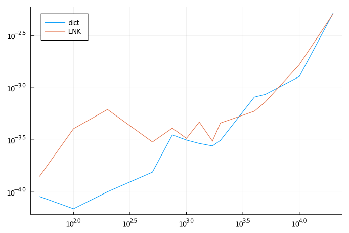
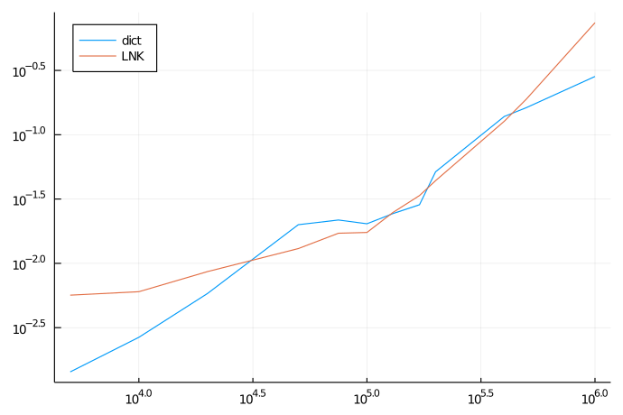

In the following the x axis shows the number of non zero entries in a matrix. 
The y axis shows the average runtime of the assembly in ms.
Both axis are log-scaled. 
For each figure, the matrix size is fixed.

### n=1000
---

### n=10000
---

### n=100000
